# Brainy Architecture Documentation
## Vector Graph Database with AI Pipeline

---

## Table of Contents

1. [System Overview](#system-overview)
2. [Core Architecture](#core-architecture)
3. [Data Model & Graph Structure](#data-model--graph-structure)
4. [Vector Search Engine](#vector-search-engine)
5. [Storage Architecture](#storage-architecture)
6. [Augmentation Pipeline](#augmentation-pipeline)
7. [Performance Optimizations](#performance-optimizations)
8. [Cross-Platform Integration](#cross-platform-integration)
9. [Data Flow Example](#data-flow-example)

---

## System Overview

Brainy is a powerful, cross-platform vector graph database that intelligently adapts to any environment while providing both semantic vector search and graph relationship capabilities.


### Key Features

- **Universal Compatibility**: Runs everywhere - browsers, Node.js, serverless functions, containers
- **Intelligent Adaptation**: Automatically optimizes for environment and usage patterns
- **Dual Nature**: Vector similarity search + graph relationships in one system
- **Real-time Streaming**: Live data processing through extensible pipeline
- **AI Integration**: Built-in TensorFlow.js with GPU acceleration

---

## Core Architecture

```mermaid
graph TB
    subgraph "Application Layer"
        API[Brainy Data API<br/>add() | search() | addVerb() | get() | delete()]
    end
    
    subgraph "Processing Layer"
        PIPELINE[Augmentation Pipeline<br/>SENSE → MEMORY → COGNITION → CONDUIT → ACTIVATION → PERCEPTION → DIALOG → WS]
    end
    
    subgraph "Engine Layer"
        EMBED[Embedding Engine<br/>TensorFlow.js Universal Sentence Encoder]
        VECTOR[Vector Index<br/>HNSW Algorithm]
        GRAPH[Graph Engine<br/>Noun-Verb Model]
    end
    
    subgraph "Storage Layer"
        CACHE[Multi-tier Caching<br/>Hot → Warm → Cold]
        STORAGE[Adaptive Storage<br/>OPFS | FileSystem | S3 | Memory]
    end
    
    API --> PIPELINE
    PIPELINE --> EMBED
    PIPELINE --> VECTOR
    PIPELINE --> GRAPH
    EMBED --> CACHE
    VECTOR --> CACHE
    GRAPH --> STORAGE
    CACHE --> STORAGE
    
    style API fill:#e3f2fd
    style PIPELINE fill:#f1f8e9
    style EMBED fill:#fce4ec
    style VECTOR fill:#fff8e1
    style GRAPH fill:#e8f5e8
    style CACHE fill:#f3e5f5
    style STORAGE fill:#efebe9
```

---

## Data Model & Graph Structure

### Noun Types (Entities/Nodes)


### Verb Types (Relationships/Edges)


### Graph Example


---

## Vector Search Engine

### HNSW Index Structure

```mermaid
graph TB
    subgraph "HNSW Hierarchical Structure"
        subgraph "Layer 2 (Sparse)"
            L2A((●)) --- L2B((●))
            L2B --- L2C((●))
        end
        
        subgraph "Layer 1 (Medium Density)"
            L1A((●)) --- L1B((●))
            L1B --- L1C((●))
            L1C --- L1D((●))
            L1D --- L1E((●))
            L1E --- L1F((●))
            L1F --- L1G((●))
            L1G --- L1H((●))
        end
        
        subgraph "Layer 0 (Dense Connections)"
            L0A((●)) --- L0B((●))
            L0B --- L0C((●))
            L0C --- L0D((●))
            L0D --- L0E((●))
            L0E --- L0F((●))
            L0F --- L0G((●))
            L0G --- L0H((●))
            L0H --- L0I((●))
            L0I --- L0J((●))
            L0J --- L0K((●))
            L0K --- L0L((●))
            L0L --- L0M((●))
            L0M --- L0N((●))
            L0N --- L0O((●))
            L0O --- L0P((●))
        end
        
        L2A -.-> L1A
        L2A -.-> L1D
        L2B -.-> L1C
        L2B -.-> L1F
        L2C -.-> L1G
        
        L1A -.-> L0A
        L1A -.-> L0B
        L1B -.-> L0C
        L1B -.-> L0D
        L1C -.-> L0E
        L1C -.-> L0F
        L1D -.-> L0G
        L1D -.-> L0H
        L1E -.-> L0I
        L1E -.-> L0J
        L1F -.-> L0K
        L1F -.-> L0L
        L1G -.-> L0M
        L1G -.-> L0N
        L1H -.-> L0O
        L1H -.-> L0P
    end
    
    style L2A fill:#ff9999
    style L2B fill:#ff9999
    style L2C fill:#ff9999
    style L1A fill:#99ccff
    style L1B fill:#99ccff
    style L1C fill:#99ccff
    style L1D fill:#99ccff
    style L1E fill:#99ccff
    style L1F fill:#99ccff
    style L1G fill:#99ccff
    style L1H fill:#99ccff
    style L0A fill:#99ff99
    style L0B fill:#99ff99
    style L0C fill:#99ff99
    style L0D fill:#99ff99
    style L0E fill:#99ff99
    style L0F fill:#99ff99
    style L0G fill:#99ff99
    style L0H fill:#99ff99
    style L0I fill:#99ff99
    style L0J fill:#99ff99
    style L0K fill:#99ff99
    style L0L fill:#99ff99
    style L0M fill:#99ff99
    style L0N fill:#99ff99
    style L0O fill:#99ff99
    style L0P fill:#99ff99
```



### Search Process Flow


---

## Storage Architecture

### Multi-Tier Caching System

```mermaid
graph TD
    subgraph "Memory Hierarchy"
        subgraph "Hot Cache (RAM)"
            HC[Most Accessed Items<br/>LRU Eviction<br/>Auto-tuned Size<br/>Millisecond Access]
        end
        
        subgraph "Warm Cache (Storage)"
            WC[Recent Items<br/>TTL-based<br/>Sub-second Access<br/>OPFS/FS/S3]
        end
        
        subgraph "Cold Storage (Persistent)"
            CS[All Items<br/>Batch Operations<br/>Full Persistence<br/>OPFS/FS/S3]
        end
    end
    
    subgraph "Environment Adapters"
        Browser[Browser<br/>OPFS → IndexedDB]
        NodeJS[Node.js<br/>FileSystem → S3]
        Serverless[Serverless<br/>Memory → S3]
        Container[Container<br/>Auto-detect]
        Server[Server<br/>S3/Multi-cloud]
    end
    
    User[User Query] --> HC
    HC -->|Cache Miss| WC
    WC -->|Cache Miss| CS
    
    CS --> Browser
    CS --> NodeJS
    CS --> Serverless
    CS --> Container
    CS --> Server
    
    style HC fill:#ffcdd2
    style WC fill:#fff9c4
    style CS fill:#c8e6c9
    style Browser fill:#e1f5fe
    style NodeJS fill:#e8f5e8
    style Serverless fill:#f3e5f5
    style Container fill:#fff3e0
    style Server fill:#efebe9
```



### Storage Performance Characteristics


---

## Augmentation Pipeline

### Pipeline Flow Architecture


### Augmentation Types Detail


---

## Performance Optimizations

### Multithreading Architecture


### Performance Metrics


---

## Cross-Platform Integration

### Synchronization Network

```mermaid
graph TB
    subgraph "Browser Instances"
        B1[Browser 1]
        B2[Browser 2]
        B3[Browser 3]
    end
    
    subgraph "Server Infrastructure"
        WS[WebSocket Server]
        API[REST API Server]
        S3[S3/Cloud Storage]
    end
    
    subgraph "Peer-to-Peer"
        STUN[STUN Server]
        SIGNAL[Signaling Server]
    end
    
    subgraph "External AI"
        MCP[MCP Server]
        AI[AI Models]
    end
    
    B1 <-->|WebSocket| WS
    B2 <-->|WebSocket| WS
    B3 <-->|WebSocket| WS
    
    B1 <-.->|WebRTC| B2
    B2 <-.->|WebRTC| B3
    B1 <-.->|WebRTC| B3
    
    WS <--> S3
    API <--> S3
    
    B1 -.->|Signaling| SIGNAL
    B2 -.->|Signaling| SIGNAL
    B3 -.->|Signaling| SIGNAL
    
    SIGNAL -.-> STUN
    
    WS <--> MCP
    MCP <--> AI
    
    style B1 fill:#e3f2fd
    style B2 fill:#e3f2fd
    style B3 fill:#e3f2fd
    style WS fill:#e8f5e8
    style API fill:#e8f5e8
    style S3 fill:#fff3e0
    style MCP fill:#f3e5f5
    style AI fill:#ffebee
```



### Model Control Protocol (MCP) Integration


---

## Data Flow Example

### Complete Processing Pipeline

```mermaid
flowchart TD
    subgraph "Input Processing"
        I1[Input: "Cats are independent pets"]
        I2[Metadata: {noun: "Thing", category: "animal"}]
    end
    
    subgraph "Embedding Generation"
        E1[TensorFlow.js Universal Sentence Encoder]
        E2[Vector: [0.123, -0.456, 0.789, ...]]
    end
    
    subgraph "Storage & Indexing"
        S1[Store in Multi-tier Cache]
        S2[Add to HNSW Index]
        S3[Persist to Storage Layer]
    end
    
    subgraph "Query Processing"
        Q1[Query: "feline pets"]
        Q2[Generate Query Vector]
        Q3[HNSW Similarity Search]
        Q4[Retrieve & Rank Results]
    end
    
    subgraph "Graph Operations"
        G1[Add Relationship]
        G2[catId --RelatedTo--> dogId]
        G3[Store Verb Metadata]
    end
    
    I1 --> E1
    I2 --> E1
    E1 --> E2
    E2 --> S1
    S1 --> S2
    S2 --> S3
    
    Q1 --> Q2
    Q2 --> Q3
    Q3 --> Q4
    
    E2 -.-> G1
    G1 --> G2
    G2 --> G3
    
    style I1 fill:#e8f5e8
    style E1 fill:#e3f2fd
    style E2 fill:#f3e5f5
    style S1 fill:#fff3e0
    style Q1 fill:#e8f5e8
    style Q4 fill:#ffebee
    style G2 fill:#e0f2f1
```

### Result Example

```json
{
  "results": [
    {
      "id": "noun-123",
      "text": "Cats are independent pets",
      "similarity": 0.89,
      "metadata": {
        "noun": "Thing",
        "category": "animal"
      }
    }
  ],
  "query": "feline pets",
  "processingTime": "15ms",
  "cacheHit": false
}
```

---

## Key Architecture Principles

### 🌐 **Environment Agnostic**
Automatically adapts to browser, Node.js, serverless, container, or server environments without code changes.

### 🧠 **Intelligent Storage**
Multi-tier caching with automatic storage selection optimizes for performance and persistence across platforms.

### 🔍 **Vector + Graph Unified**
Combines semantic vector search with graph relationships in a single, coherent data model.

### 🔧 **Extensible Pipeline**
Modular augmentation system allows custom processing, AI integration, and workflow automation.

### ⚡ **Performance Optimized**
GPU acceleration, multithreading, intelligent caching, and memory management deliver enterprise-grade performance.

### 🔄 **Scalable Synchronization**
WebSocket and WebRTC conduits enable real-time synchronization across instances and platforms.

### 🤖 **AI Integration Ready**
Built-in MCP protocol support allows external AI models to access Brainy data and utilize augmentation tools.

---

*Generated from Brainy v0.34.0 Architecture Documentation*