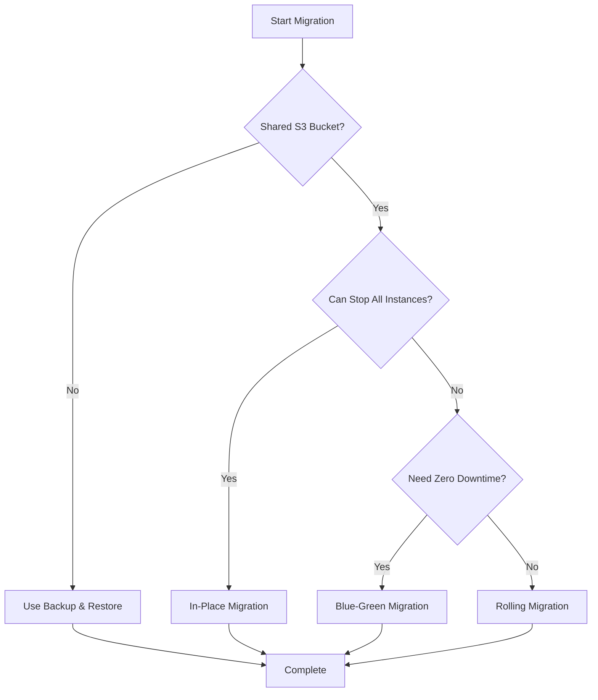

# S3 Migration Guide

Complete guide for migrating existing Brainy data to the new optimized system, with special considerations for shared S3 buckets.

## 🎯 Overview

When upgrading to Brainy v0.36.0+ with the new optimization system, you can migrate existing data without starting from scratch. This guide covers migration strategies, shared bucket considerations, and best practices.

## ✅ Key Points

- **No data loss** - All existing data is preserved and enhanced
- **Automatic optimization** - System applies all optimizations during migration
- **Backward compatible** - Can read data from any previous version
- **Zero-downtime options** - Multiple strategies for production systems

## 🔄 Migration Methods

### Method 1: Backup & Restore (Recommended)

The safest and most reliable migration approach.

```typescript
// Step 1: Export from existing Brainy instance
const oldBrainy = new BrainyData({ /* existing config */ })
const backupData = await oldBrainy.backup()

// Step 2: Save backup (optional)
import fs from 'fs'
fs.writeFileSync('brainy-backup.json', JSON.stringify(backupData))

// Step 3: Create new optimized instance
import { createAutoBrainy } from '@soulcraft/brainy'
const newBrainy = createAutoBrainy({
  bucketName: 'my-optimized-vectors'
})

// Step 4: Restore data with optimizations
const result = await newBrainy.restore(backupData, {
  clearExisting: true
})

console.log(`Migrated ${result.nounsRestored} vectors successfully`)
```

**Benefits:**
- ✅ Clean migration with no conflicts
- ✅ Can test before switching production
- ✅ Rollback option available
- ✅ Works with any storage backend

### Method 2: In-Place Upgrade

Upgrade existing data without moving it.

```typescript
import { createAutoBrainy } from '@soulcraft/brainy'

// Point to existing data location
const brainy = createAutoBrainy({
  bucketName: 'existing-bucket' // Same as old instance
})

// System automatically:
// 1. Detects existing data format
// 2. Rebuilds optimized HNSW index
// 3. Applies semantic partitioning
// 4. Enables all optimizations

// First operation triggers optimization
const results = await brainy.search([0.1, 0.2, 0.3], 10)
```

**Benefits:**
- ✅ No data movement required
- ✅ Immediate optimization benefits
- ✅ Minimal downtime

**Limitations:**
- ⚠️ Requires exclusive access during initial optimization
- ⚠️ No rollback without backup

### Method 3: Sparse Data Import

For migrating raw data without vectors.

```typescript
// Import data without vectors (they'll be regenerated)
const sparseData = {
  nouns: [
    {
      id: 'doc-1',
      metadata: {
        text: 'Machine learning algorithms',
        noun: 'Thing',
        category: 'technology'
      }
      // No vector field - will be auto-generated
    }
  ],
  verbs: [],
  version: '1.0.0'
}

const brainy = createAutoBrainy()
const result = await brainy.importSparseData(sparseData)
```

**Benefits:**
- ✅ Smaller backup files
- ✅ Ensures vectors use latest embedding model
- ✅ Good for data format migrations

## 🗄️ Shared S3 Bucket Considerations

When multiple Brainy instances share the same S3 bucket, special care is needed during migration.

### Understanding Shared Bucket Architecture

```
shared-bucket/
├── nouns/              # Vector data
├── verbs/              # Relationships  
├── metadata/           # Additional metadata
├── index/              # HNSW index data
├── statistics/         # System statistics
├── change-log/         # Change tracking with instance IDs
└── locks/              # Distributed locks for coordination
```

### Built-in Safety Features

1. **Distributed Locking**
   - Prevents concurrent modifications
   - 30-second TTL with automatic cleanup
   - Coordinates between multiple instances

2. **Instance Tracking**
   ```typescript
   // Each modification includes instance identification
   {
     timestamp: 1234567890,
     operation: 'add',
     instanceId: 'process-123' // or 'browser'
   }
   ```

3. **Conflict Detection**
   - Change logs track all modifications
   - Enables conflict resolution
   - Maintains data consistency

### ⚠️ Potential Issues with Shared Buckets

| Issue | Impact | Solution |
|-------|--------|----------|
| **Namespace Collision** | Different apps overwrite data | Use unique prefixes |
| **Index Corruption** | Multiple rebuilds conflict | Coordinate migrations |
| **Lock Contention** | Performance degradation | Stagger instance updates |
| **Statistics Conflicts** | Incorrect metrics | Use distributed locking |

## 📋 Migration Strategies for Shared Buckets

### Strategy 1: Dedicated Namespace (Recommended)

Create isolation using bucket subfolders.

```typescript
// Each application uses its own namespace
const brainy = createAutoBrainy({
  bucketName: 'shared-bucket/app-name/v2',
  region: 'us-east-1'
})

// Data structure becomes:
// shared-bucket/
//   app-name/
//     v2/
//       nouns/
//       verbs/
//       ...
```

### Strategy 2: Blue-Green Migration

Run old and new systems in parallel.

```typescript
// Phase 1: Create new optimized instance in separate bucket
const newBrainy = createAutoBrainy({
  bucketName: 'optimized-vectors',
  region: 'us-east-1'
})

// Phase 2: Sync data from old to new
const backupData = await oldBrainy.backup()
await newBrainy.restore(backupData)

// Phase 3: Run both systems in parallel
// - Old system: Handles writes
// - New system: Handles reads (testing)

// Phase 4: Switch traffic to new system
// Phase 5: Decommission old system
```

### Strategy 3: Rolling Migration

Gradually migrate instances with zero downtime.

```typescript
// Step 1: Set read-only mode on secondary instances
const readOnlyInstances = instances.map(instance => {
  instance.setReadOnly(true)
  return instance
})

// Step 2: Migrate primary write instance
const primaryBrainy = createAutoBrainy({
  bucketName: 'shared-bucket',
  learningEnabled: true
})

// Step 3: Gradually migrate read instances
for (const instance of readOnlyInstances) {
  const optimized = createAutoBrainy({
    bucketName: 'shared-bucket',
    readOnlyMode: true
  })
  // Replace old instance with optimized
}
```

### Strategy 4: Coordinated In-Place Migration

Migrate with careful coordination.

```typescript
async function coordinatedMigration() {
  // Step 1: Announce maintenance window
  console.log('Starting coordinated migration...')
  
  // Step 2: Stop all write operations
  const instances = await getAllInstances()
  instances.forEach(i => i.setReadOnly(true))
  
  // Step 3: Wait for in-flight operations
  await new Promise(resolve => setTimeout(resolve, 5000))
  
  // Step 4: Perform migration
  const brainy = createAutoBrainy({
    bucketName: 'shared-bucket',
    autoConfigureEnvironment: true,
    learningEnabled: true
  })
  
  // Step 5: Verify migration
  const stats = await brainy.getStatistics()
  console.log(`Migrated ${stats.nounCount} vectors`)
  
  // Step 6: Resume operations
  instances.forEach(i => i.setReadOnly(false))
}
```

## 🛡️ Best Practices

### 1. Pre-Migration Checklist

- [ ] **Backup existing data** using `backup()` method
- [ ] **Test migration** with subset of data
- [ ] **Monitor S3 costs** during migration (increased API calls)
- [ ] **Plan maintenance window** if using shared bucket
- [ ] **Verify credentials** for S3 access
- [ ] **Check available storage** for temporary duplication

### 2. Performance Monitoring

```typescript
// Monitor migration progress and performance
const brainy = createAutoBrainy({ /* config */ })

// Check optimization status
setInterval(async () => {
  const metrics = brainy.getPerformanceMetrics()
  console.log({
    vectorsProcessed: metrics.indexSize,
    searchLatency: metrics.averageSearchTime,
    cacheHitRate: metrics.cacheHitRate,
    memoryUsage: metrics.memoryUsage
  })
}, 10000)
```

### 3. Handling Large Datasets

For datasets over 1M vectors:

```typescript
// Use scenario-based configuration
const brainy = await createQuickBrainy('enterprise', {
  bucketName: 'large-vectors',
  region: 'us-east-1'
})

// Or manual configuration for fine control
const brainy = createAutoBrainy({
  expectedDatasetSize: 5000000,
  maxMemoryUsage: 16 * 1024 * 1024 * 1024, // 16GB
  targetSearchLatency: 500,
  s3Config: {
    bucketName: 'large-vectors',
    region: 'us-east-1'
  }
})
```

### 4. Rollback Plan

Always maintain ability to rollback:

```typescript
// Before migration
const backupData = await oldBrainy.backup()
fs.writeFileSync('backup-{timestamp}.json', JSON.stringify(backupData))

// If rollback needed
const oldBrainy = new BrainyData({ /* old config */ })
await oldBrainy.restore(backupData, { clearExisting: true })
```

## 📊 Expected Performance Improvements

After migration with optimizations:

| Dataset Size | Before | After | Improvement |
|-------------|--------|-------|-------------|
| **10k vectors** | ~200ms | ~50ms | **4x faster** |
| **100k vectors** | ~2s | ~200ms | **10x faster** |
| **1M vectors** | ~10s | ~500ms | **20x faster** |
| **Memory Usage** | 100% | 25-30% | **70-75% reduction** |
| **S3 API Calls** | 100% | 10-50% | **50-90% reduction** |

## 🔍 Troubleshooting

### Common Issues and Solutions

| Problem | Cause | Solution |
|---------|-------|----------|
| **"Lock timeout" errors** | Multiple instances competing | Stagger migration timing |
| **High memory usage** | Large dataset loading | Enable compression, reduce cache |
| **Slow initial searches** | Index rebuilding | Wait for optimization to complete |
| **S3 rate limiting** | Too many concurrent operations | Reduce batch sizes |
| **Missing vectors** | Sparse data import | Ensure embedding function available |

### Debug Logging

Enable detailed logging during migration:

```typescript
// Set environment variable
process.env.BRAINY_DEBUG = 'true'

const brainy = createAutoBrainy({
  bucketName: 'my-bucket',
  // Logs will show optimization decisions
})
```

### Verification Steps

After migration, verify success:

```typescript
async function verifyMigration(brainy) {
  // 1. Check data integrity
  const stats = await brainy.getStatistics()
  console.log(`Vectors: ${stats.nounCount}`)
  console.log(`Relationships: ${stats.verbCount}`)
  
  // 2. Test search performance
  const testVector = [0.1, 0.2, 0.3]
  const start = Date.now()
  const results = await brainy.search(testVector, 10)
  console.log(`Search time: ${Date.now() - start}ms`)
  
  // 3. Verify optimizations active
  const metrics = brainy.getPerformanceMetrics()
  console.log(`Cache hit rate: ${metrics.cacheHitRate}`)
  console.log(`Compression ratio: ${metrics.compressionRatio}`)
  
  return stats.nounCount > 0 && results.length > 0
}
```

## 🎯 Quick Decision Guide

Choose your migration approach:



## 💡 Tips for Success

1. **Start Small**: Test with 1% of data first
2. **Monitor Metrics**: Use `getPerformanceMetrics()` frequently
3. **Use Read-Only Mode**: For instances that only search
4. **Plan S3 Costs**: Migration causes temporary spike in API calls
5. **Keep Backups**: Always maintain rollback capability
6. **Leverage Auto-Config**: Let system optimize automatically
7. **Document Process**: Record settings for reproducibility

## 🔗 Related Documentation

- [Large-Scale Optimizations](./large-scale-optimizations.md) - Understanding the optimization system
- [Auto-Configuration Guide](./auto-configuration.md) - How automatic optimization works
- [Storage Optimization](./storage-optimization.md) - S3 and storage best practices
- [Production Migration Guide](../guides/production-migration-guide.md) - General production deployment

## 🆘 Getting Help

- **GitHub Issues**: Report migration problems
- **Discussions**: Share migration experiences
- **Documentation**: Check other guides for specific features

---

**Ready to migrate?** Start with a backup, test thoroughly, and enjoy 10-20x performance improvements! 🚀